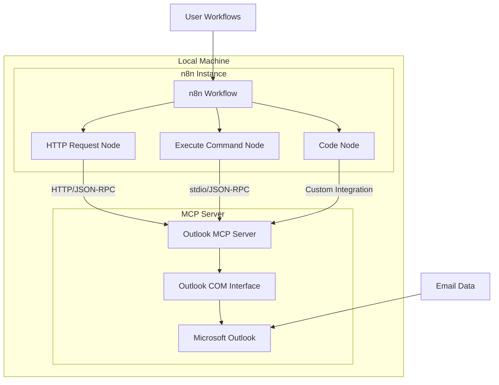
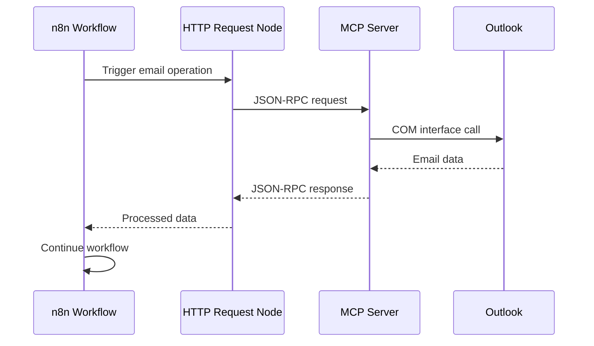

# Design Document - n8n Integration Guide

## Overview

This design outlines the creation of comprehensive documentation for integrating the Outlook MCP server with local n8n instances. The documentation will enable users to leverage Outlook email functionality within n8n workflows through localhost connections, eliminating the need for public domains or static IP addresses.

The integration leverages n8n's HTTP Request node and Execute Command node capabilities to communicate with the MCP server running locally. The design focuses on providing clear setup instructions, practical examples, security guidance, and comprehensive API documentation.

## Architecture

### Integration Architecture



### Communication Patterns

1. **HTTP-based Communication**: Using n8n's HTTP Request node to send JSON-RPC requests to the MCP server
2. **stdio-based Communication**: Using n8n's Execute Command node to run MCP server commands directly
3. **Custom Node Integration**: Advanced users can create custom n8n nodes for seamless integration

### Data Flow



## Components and Interfaces

### Documentation Structure

The documentation will be organized into the following components:

#### 1. Setup and Configuration Guide
- **Purpose**: Provide step-by-step setup instructions
- **Location**: `docs/N8N_INTEGRATION_SETUP.md`
- **Content**:
  - Prerequisites and system requirements
  - MCP server installation and configuration
  - n8n configuration for localhost communication
  - Connection validation procedures

#### 2. Integration Methods Documentation
- **Purpose**: Detail different integration approaches
- **Location**: `docs/N8N_INTEGRATION_METHODS.md`
- **Content**:
  - HTTP Request node configuration
  - Execute Command node setup
  - Custom node development guide
  - Performance considerations for each method

#### 3. Workflow Examples and Templates
- **Purpose**: Provide ready-to-use workflow examples
- **Location**: `docs/N8N_WORKFLOW_EXAMPLES.md`
- **Content**:
  - Email monitoring workflows
  - Automated response systems
  - Email data extraction and processing
  - Multi-step email automation scenarios

#### 4. API Reference for n8n
- **Purpose**: n8n-specific API documentation
- **Location**: `docs/N8N_API_REFERENCE.md`
- **Content**:
  - JSON-RPC request formats for n8n nodes
  - Response handling patterns
  - Error handling in n8n workflows
  - Parameter mapping and validation

#### 5. Security and Best Practices
- **Purpose**: Security guidance for production use
- **Location**: `docs/N8N_SECURITY_GUIDE.md`
- **Content**:
  - Localhost security considerations
  - Credential management
  - Network isolation techniques
  - Monitoring and auditing

#### 6. Troubleshooting Guide
- **Purpose**: Common issues and solutions
- **Location**: `docs/N8N_TROUBLESHOOTING.md`
- **Content**:
  - Connection issues
  - Performance problems
  - Error code explanations
  - Debug procedures

### Integration Interfaces

#### HTTP Request Node Interface
```json
{
  "method": "POST",
  "url": "http://127.0.0.1:8080/mcp",
  "headers": {
    "Content-Type": "application/json"
  },
  "body": {
    "jsonrpc": "2.0",
    "id": "{{ $workflow.id }}-{{ $node.id }}",
    "method": "list_emails",
    "params": {
      "folder": "Inbox",
      "unread_only": true,
      "limit": 10
    }
  }
}
```

#### Execute Command Node Interface
```bash
python "C:\path\to\outlook-mcp-server\main.py" stdio --single-request --method list_emails --params '{"folder":"Inbox","limit":10}'
```

#### Custom Node Interface (TypeScript)
```typescript
interface MCPNodeProperties {
  method: string;
  folder?: string;
  emailId?: string;
  query?: string;
  limit?: number;
  unreadOnly?: boolean;
}

interface MCPNodeResponse {
  success: boolean;
  data: any;
  error?: string;
}
```

## Data Models

### n8n Workflow Data Models

#### Email List Response Model
```json
{
  "emails": [
    {
      "id": "string",
      "subject": "string",
      "sender": "string",
      "sender_email": "string",
      "received_time": "ISO8601",
      "is_read": "boolean",
      "has_attachments": "boolean",
      "folder_name": "string",
      "body_preview": "string"
    }
  ],
  "total_count": "number",
  "has_more": "boolean"
}
```

#### Email Detail Response Model
```json
{
  "email": {
    "id": "string",
    "subject": "string",
    "sender": "string",
    "sender_email": "string",
    "recipients": ["string"],
    "body": "string",
    "body_html": "string",
    "received_time": "ISO8601",
    "attachments": [
      {
        "name": "string",
        "size": "number",
        "type": "string"
      }
    ]
  }
}
```

#### Folder List Response Model
```json
{
  "folders": [
    {
      "id": "string",
      "name": "string",
      "full_path": "string",
      "item_count": "number",
      "unread_count": "number"
    }
  ]
}
```

### n8n Node Configuration Models

#### HTTP Request Node Configuration
```json
{
  "typeVersion": 1,
  "position": [250, 300],
  "parameters": {
    "url": "http://127.0.0.1:8080/mcp",
    "options": {
      "timeout": 30000,
      "retry": {
        "enabled": true,
        "maxRetries": 3
      }
    },
    "sendHeaders": true,
    "headerParameters": {
      "parameters": [
        {
          "name": "Content-Type",
          "value": "application/json"
        }
      ]
    }
  }
}
```

## Error Handling

### Error Response Format for n8n
```json
{
  "jsonrpc": "2.0",
  "id": "request_id",
  "error": {
    "code": -32000,
    "message": "Error description",
    "data": {
      "type": "ErrorType",
      "details": "Additional information",
      "n8n_guidance": "Specific guidance for n8n users"
    }
  }
}
```

### n8n Error Handling Patterns

#### Try-Catch Pattern in Code Node
```javascript
try {
  const response = await this.helpers.httpRequest({
    method: 'POST',
    url: 'http://127.0.0.1:8080/mcp',
    body: {
      jsonrpc: '2.0',
      id: $workflow.id,
      method: 'list_emails',
      params: { folder: 'Inbox' }
    }
  });
  
  return [{ json: response }];
} catch (error) {
  // Handle MCP server errors
  if (error.response?.data?.error) {
    throw new Error(`MCP Error: ${error.response.data.error.message}`);
  }
  throw error;
}
```

#### Error Handling in HTTP Request Node
- Configure error handling in node settings
- Use "Continue on Fail" option for graceful degradation
- Implement retry logic with exponential backoff
- Log errors for debugging and monitoring

## Testing Strategy

### Integration Testing Approach

#### 1. Connection Testing
- Verify MCP server accessibility from n8n
- Test different communication methods (HTTP, stdio)
- Validate authentication and security settings
- Check network connectivity and firewall rules

#### 2. Functional Testing
- Test all MCP server methods through n8n nodes
- Verify data transformation and mapping
- Test error handling and edge cases
- Validate workflow execution under various conditions

#### 3. Performance Testing
- Measure response times for different operations
- Test concurrent workflow execution
- Evaluate memory and CPU usage
- Test with large datasets and high-frequency operations

#### 4. Security Testing
- Verify localhost-only access restrictions
- Test credential handling and storage
- Validate data sanitization and validation
- Check for potential security vulnerabilities

### Test Scenarios

#### Basic Connectivity Test
```json
{
  "name": "MCP Server Connection Test",
  "nodes": [
    {
      "name": "Test Connection",
      "type": "n8n-nodes-base.httpRequest",
      "parameters": {
        "url": "http://127.0.0.1:8080/health",
        "method": "GET"
      }
    }
  ]
}
```

#### Email List Test Workflow
```json
{
  "name": "Email List Test",
  "nodes": [
    {
      "name": "Get Emails",
      "type": "n8n-nodes-base.httpRequest",
      "parameters": {
        "url": "http://127.0.0.1:8080/mcp",
        "method": "POST",
        "body": {
          "jsonrpc": "2.0",
          "id": "test-1",
          "method": "list_emails",
          "params": {
            "folder": "Inbox",
            "limit": 5
          }
        }
      }
    },
    {
      "name": "Process Results",
      "type": "n8n-nodes-base.code",
      "parameters": {
        "jsCode": "// Process and validate email data\nreturn items.map(item => ({\n  json: {\n    emailCount: item.json.result?.length || 0,\n    success: !!item.json.result\n  }\n}));"
      }
    }
  ]
}
```

### Validation Procedures

#### Setup Validation Checklist
1. MCP server starts successfully
2. Outlook connection established
3. n8n can reach MCP server on localhost
4. JSON-RPC communication works
5. All MCP methods accessible
6. Error handling functions correctly
7. Performance meets requirements

#### Workflow Validation Process
1. Import example workflows
2. Configure connection parameters
3. Execute test workflows
4. Verify expected outputs
5. Test error scenarios
6. Validate performance metrics

## Implementation Considerations

### Documentation Format and Structure

#### Markdown Structure
- Use consistent heading hierarchy
- Include code blocks with syntax highlighting
- Provide copy-paste ready examples
- Use tables for parameter documentation
- Include diagrams using Mermaid syntax

#### Interactive Elements
- Step-by-step setup wizards
- Configuration generators
- Workflow templates for import
- Troubleshooting decision trees

### Maintenance and Updates

#### Version Management
- Track MCP server version compatibility
- Document n8n version requirements
- Maintain changelog for integration updates
- Provide migration guides for breaking changes

#### Community Contributions
- Establish contribution guidelines
- Create templates for new examples
- Implement review process for community workflows
- Maintain example workflow library

### Deployment Strategy

#### Documentation Hosting
- Include in main project repository
- Generate static documentation site
- Provide offline documentation package
- Maintain searchable documentation index

#### Example Distribution
- Package workflow templates
- Provide configuration generators
- Create setup automation scripts
- Distribute through n8n community

This design provides a comprehensive foundation for creating documentation that enables seamless integration between the Outlook MCP server and n8n workflows, addressing all requirements while maintaining security and performance standards.