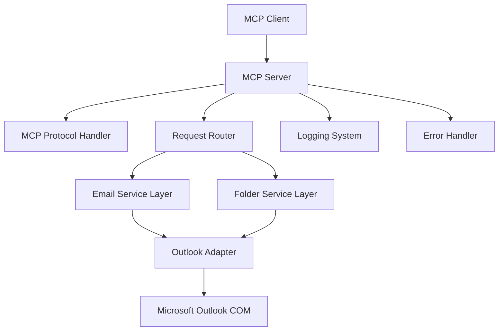

# Design Document

## Overview

The Outlook MCP Server is a Python-based application that implements the Model Context Protocol (MCP) to provide programmatic access to Microsoft Outlook email functionality. The server acts as a bridge between MCP-compatible clients and the Outlook application, exposing four core email operations through a standardized protocol interface.

The architecture follows a layered approach with clear separation between the MCP protocol handling, business logic, and Outlook integration. This design ensures maintainability, testability, and adherence to MCP specifications while providing robust email access capabilities.

## Architecture



### Core Components

1. **MCP Protocol Handler**: Manages MCP protocol compliance, handshake, and message formatting
2. **Request Router**: Routes incoming requests to appropriate service handlers
3. **Service Layer**: Business logic for email and folder operations
4. **Outlook Adapter**: Low-level interface with Outlook COM objects
5. **Error Handler**: Centralized error processing and response formatting
6. **Logging System**: Comprehensive activity and error logging

## Components and Interfaces

### MCP Protocol Handler

**Purpose**: Implements MCP protocol specification for client communication

**Key Responsibilities**:
- Handle MCP handshake and capability negotiation
- Parse incoming MCP requests and format responses
- Manage protocol-level error handling
- Maintain client session state

**Interface**:
```python
class MCPProtocolHandler:
    def handle_handshake(self, client_info: dict) -> dict
    def process_request(self, request: MCPRequest) -> MCPResponse
    def format_response(self, data: any, request_id: str) -> dict
    def format_error(self, error: Exception, request_id: str) -> dict
```

### Request Router

**Purpose**: Route MCP requests to appropriate service handlers

**Key Responsibilities**:
- Parse method names and route to correct handlers
- Validate request parameters
- Coordinate between services and protocol handler

**Interface**:
```python
class RequestRouter:
    def route_request(self, method: str, params: dict) -> any
    def register_handler(self, method: str, handler: callable)
    def validate_params(self, method: str, params: dict) -> bool
```

### Email Service

**Purpose**: Handle all email-related operations

**Key Responsibilities**:
- List emails with filtering and pagination
- Retrieve specific email details
- Search emails across folders
- Transform Outlook email objects to JSON

**Interface**:
```python
class EmailService:
    def list_emails(self, folder: str = None, unread_only: bool = False, limit: int = 50) -> List[dict]
    def get_email(self, email_id: str) -> dict
    def search_emails(self, query: str, folder: str = None, limit: int = 50) -> List[dict]
    def _transform_email(self, outlook_email) -> dict
```

### Folder Service

**Purpose**: Handle folder-related operations

**Key Responsibilities**:
- List available folders
- Validate folder access
- Transform folder objects to JSON

**Interface**:
```python
class FolderService:
    def get_folders(self) -> List[dict]
    def validate_folder(self, folder_name: str) -> bool
    def _transform_folder(self, outlook_folder) -> dict
```

### Outlook Adapter

**Purpose**: Low-level interface with Microsoft Outlook COM objects

**Key Responsibilities**:
- Establish and maintain Outlook connection
- Execute Outlook COM operations
- Handle Outlook-specific exceptions
- Manage COM object lifecycle

**Interface**:
```python
class OutlookAdapter:
    def connect(self) -> bool
    def get_namespace(self) -> object
    def get_folder_by_name(self, name: str) -> object
    def get_email_by_id(self, email_id: str) -> object
    def search_emails(self, query: str, folder: object = None) -> List[object]
    def disconnect(self)
```

## Data Models

### Email Data Model

```python
@dataclass
class EmailData:
    id: str
    subject: str
    sender: str
    sender_email: str
    recipients: List[str]
    cc_recipients: List[str]
    bcc_recipients: List[str]
    body: str
    body_html: str
    received_time: datetime
    sent_time: datetime
    is_read: bool
    has_attachments: bool
    importance: str
    folder_name: str
    size: int
```

### Folder Data Model

```python
@dataclass
class FolderData:
    id: str
    name: str
    full_path: str
    item_count: int
    unread_count: int
    parent_folder: str
    folder_type: str
```

### MCP Request/Response Models

```python
@dataclass
class MCPRequest:
    jsonrpc: str
    id: str
    method: str
    params: dict

@dataclass
class MCPResponse:
    jsonrpc: str
    id: str
    result: any = None
    error: dict = None
```

## Error Handling

### Error Categories

1. **Protocol Errors**: Invalid MCP requests, malformed JSON
2. **Authentication Errors**: Outlook connection failures
3. **Parameter Errors**: Invalid or missing parameters
4. **Resource Errors**: Missing emails, folders, or access denied
5. **System Errors**: Unexpected exceptions, COM errors

### Error Response Format

```python
{
    "jsonrpc": "2.0",
    "id": "request_id",
    "error": {
        "code": -32000,
        "message": "Outlook connection failed",
        "data": {
            "type": "OutlookConnectionError",
            "details": "Could not establish COM connection to Outlook"
        }
    }
}
```

### Error Handling Strategy

- **Graceful Degradation**: Continue operation when possible
- **Detailed Logging**: Log all errors with context for debugging
- **User-Friendly Messages**: Provide clear error descriptions
- **Retry Logic**: Implement retry for transient COM errors
- **Resource Cleanup**: Ensure COM objects are properly released

## Testing Strategy

### Unit Testing

- **Service Layer Tests**: Mock Outlook adapter, test business logic
- **Adapter Tests**: Test COM integration with mock Outlook objects
- **Protocol Handler Tests**: Test MCP compliance and message formatting
- **Error Handler Tests**: Verify error scenarios and response formatting

### Integration Testing

- **End-to-End Tests**: Test complete request flow with real Outlook
- **COM Integration Tests**: Verify Outlook COM object interactions
- **Protocol Compliance Tests**: Validate MCP specification adherence
- **Performance Tests**: Test concurrent request handling

### Test Data Management

- **Mock Email Data**: Create realistic test email objects
- **Folder Hierarchy**: Test with complex folder structures
- **Edge Cases**: Test with empty folders, large emails, special characters
- **Error Scenarios**: Test connection failures, invalid parameters

### Testing Tools

- **pytest**: Primary testing framework
- **unittest.mock**: Mock Outlook COM objects
- **pytest-asyncio**: Test concurrent operations
- **coverage.py**: Code coverage analysis

## Implementation Considerations

### Performance Optimization

- **Connection Pooling**: Reuse Outlook connections when possible
- **Lazy Loading**: Load email details only when requested
- **Pagination**: Implement efficient pagination for large result sets
- **Caching**: Cache folder structures and frequently accessed data

### Security Considerations

- **Input Validation**: Sanitize all user inputs
- **Access Control**: Respect Outlook folder permissions
- **Error Information**: Avoid exposing sensitive system information
- **Resource Limits**: Implement request rate limiting and timeouts

### Deployment Requirements

- **Python 3.8+**: Modern Python version with async support
- **pywin32**: Windows COM interface library
- **Microsoft Outlook**: Installed and configured on target system
- **Windows Environment**: COM integration requires Windows platform

### Logging Configuration

- **Structured Logging**: Use JSON format for log entries
- **Log Levels**: DEBUG, INFO, WARNING, ERROR, CRITICAL
- **Log Rotation**: Prevent log files from growing too large
- **Performance Metrics**: Log request timing and resource usage